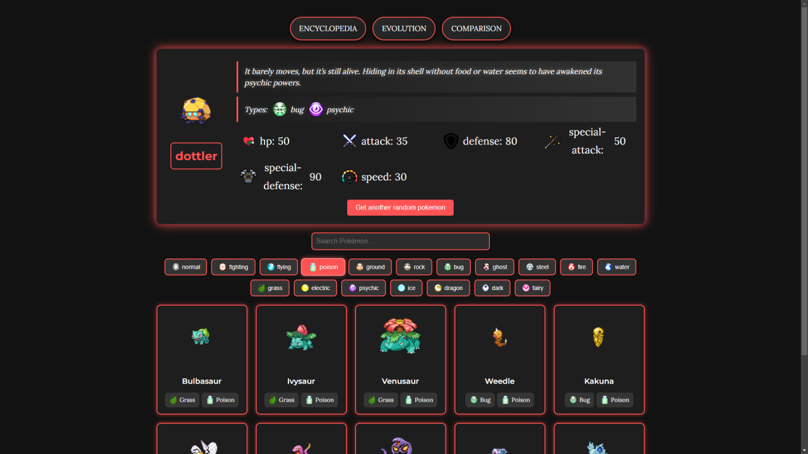

# Pokeshere

**Pokeshere** — это веб-приложение, посвященное миру покемонов. Оно позволяет искать, фильтровать, изучать эволюции покемонов и сравнивать их. Проект создан с использованием современных технологий и API для демонстрации навыков разработки.

## 🚀 Демо

Приложение доступно по ссылке: [Pokeshere](https://AleksandrRDK.github.io/pokeshere)

## Скриншоты

### Десктопная версия



### Мобильная версия


## 📚 Возможности

- **Энциклопедия покемонов**:

  - Отображение списка покемонов с возможностью поиска и фильтрации.
  - При нажатии на покемона перебрасывает на его личную страницу.
  - Загрузка покемонов порциями с помощью кнопки "Load More".

- **Дерево эволюций**:

  - Отображение цепочек эволюции для выбранного покемона.

- **Сравнение покемонов**:
  - Выбор двух покемонов для сравнения их характеристик.

## 🛠 Используемые технологии

### Основной стек:

- **React** — библиотека для создания пользовательских интерфейсов.
- **TypeScript** — для типизации и повышения надежности кода.
- **React Router** — для маршрутизации между страницами.
- **Axios** — для работы с API запросами.
- **Scss** — для стилизации и работы с CSS-переменными.

### Вспомогательные инструменты:

- **Create React App (CRA)** — для создания и конфигурации React-приложения.
- **gh-pages** — для деплоя приложения на GitHub Pages.

### API:

- **PokéAPI** — для получения данных о покемонах, их эволюциях и характеристиках.

## 🔧 Установка и запуск

1. Склонируйте репозиторий:
   ```bash
   git clone https://github.com/AleksandrRDK/pokeshere.git
   ```
2. Перейдите в директорию проекта:
   ```bash
   cd pokeshere
   ```
3. Установите зависимости:
   ```bash
   npm install
   ```
4. Запустите проект в режиме разработки:
   ```bash
   npm start
   ```
5. Откройте в браузере: http://localhost:3000

## Планы по улучшению

- Добавить анимацию
- После сравнения подсвечивать ник победителя зеленым

## Вклад в проект

Если вы хотите внести свой вклад, выполните следующие шаги:

1. **Сделайте форк репозитория** — создайте копию репозитория в вашем аккаунте.
2. **Создайте новую ветку** (`git checkout -b feature/new-feature`).
3. **Закоммитьте изменения** (`git commit -m 'Add new feature'`).
4. **Запушьте изменения** (`git push origin feature/new-feature`).
5. **Создайте Pull Request** в оригинальный репозиторий.

## Автор

- **AleksandrRDK**
